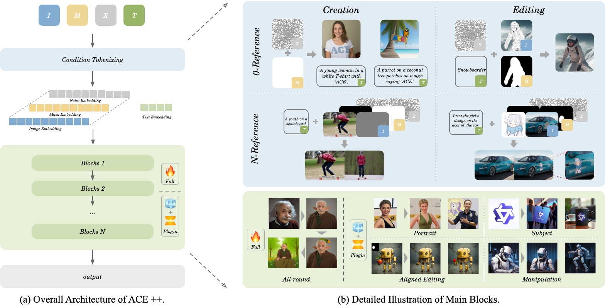

<p align="center">

  <h2 align="center"> ++: Instruction-Based Image Creation and Editing <br> via Context-Aware Content Filling </h2>

  <p align="center">
    <a href=""></a>
    <a href=''></a>
    <a href=''></a>
    <a href=''></a>
    <a href=''></a>
    <a href=''></a>
    <br>
    <strong>Chaojie Mao</strong>
    ·
    <strong>Jingfeng Zhang</strong>
    ·
    <strong>Yulin Pan</strong>
    ·
    <strong>Zeyinzi Jiang</strong>
    ·
    <strong>Zhen Han</strong>
    <br>
    ·
    <strong>Yu Liu</strong>
    ·
    <strong>Jingren Zhou</strong>
    <br>
    Tongyi Lab, Alibaba Group
  </p>
  <table align="center">
    <tr>
    <td>
      
    </td>
    </tr>
  </table>

## 📢 News
* **[2025.01.03]** Release the paper of ACE++ on arxiv.

## 🚀 Installation
Install the necessary packages with `pip`: 
```bash
pip install -r requirements.txt
```


## 📝 Citation

```bibtex
@article{,
  title={},
  author={},
  journal={},
  year={2025}
}
```